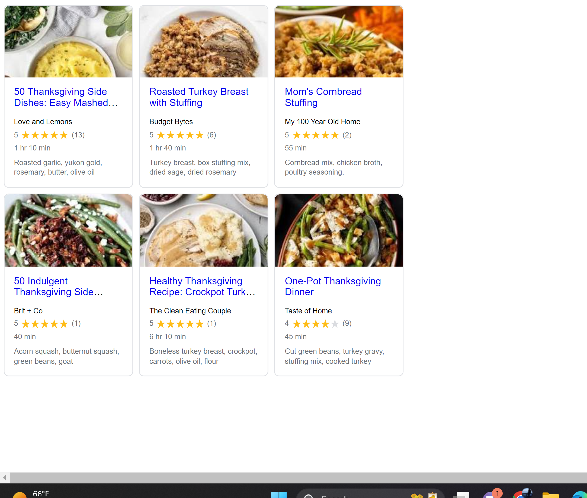

# Lab 7 - Network & ServiceWorkers

This project is a lab exercise that demonstrates the use of Service Workers and caching techniques to improve the performance and reliability of web applications. The project includes a recipe application that caches recipe data and images to improve performance and enable offline use.

## Installation

Clone this repository to your local machine and open the `index.html` file in your web browser.

## Usage

The recipe application loads a list of Thanksgiving recipes from a JSON file and displays them on the screen. You can view the details of each recipe by clicking on its card. The application uses Service Workers to cache the recipe data and images for faster and more reliable performance.

## Contributing

Contributions are welcome! To contribute, fork this repository and make your changes. Then submit a pull request explaining your changes.

## Technical Details

The following sections provide technical details about the implementation of the project.

### Service Worker

The Service Worker is implemented in the `sw.js` file. It caches the recipe data and intercepts network requests to provide offline functionality.

### JavaScript

The main JavaScript code for the project is located in the `assets/scripts/main.js` file. It initializes the Service Worker and loads the recipe data.

### CSS

The CSS code for the project is located in the `assets/styles/main.css` file. It defines the styles for the recipe cards and other UI elements.

### Recipe Card Custom Element

The `RecipeCard.js` file defines a custom HTML element for displaying recipe cards. It is used by the main JavaScript code to create the recipe cards.

### Thanksgiving Recipes

The Thanksgiving recipes are loaded from the following JSON files:

- https://introweb.tech/assets/json/1_50-thanksgiving-side-dishes.json
- https://introweb.tech/assets/json/2_roasting-turkey-breast-with-stuffing.json
- https://introweb.tech/assets/json/3_moms-cornbread-stuffing.json
- https://introweb.tech/assets/json/4_50-indulgent-thanksgiving-side-dishes-for-any-holiday-gathering.json
- https://introweb.tech/assets/json/5_healthy-thanksgiving-recipe-crockpot-turkey-breast.json
- https://introweb.tech/assets/json/6_one-pot-thanksgiving-dinner.json

### Output
